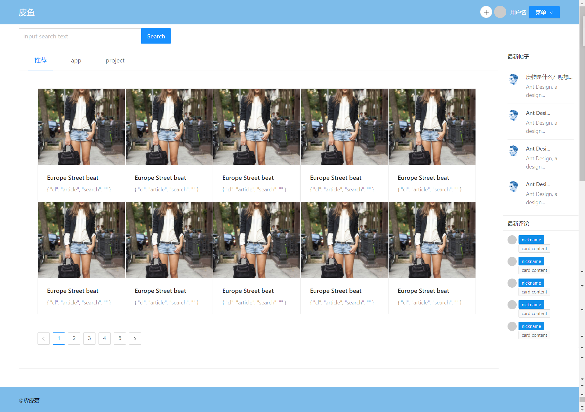

# PiYuVite

`任何发表过 反华、港独、台独言论的人都不得使用本项目，禁止使用本项目的代码。`

#### 介绍

皮鱼Pc前端

#### 软件架构
软件架构说明

使用vite+Vue3 + typescript

#### 效果图

#### 安装教程

1.  在Local Storage 内添加 一对 piyu:123123 即可正常看其它界面效果
    * 
2.  xxxx
3.  xxxx

#### 使用说明

1.  yarn dev 启动项目

#### 参与贡献

1.  Fork 本仓库
2.  新建 Feat_xxx 分支
3.  提交代码
4.  新建 Pull Request
